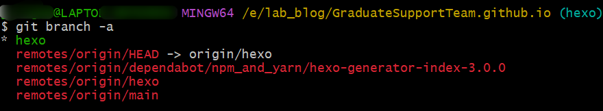
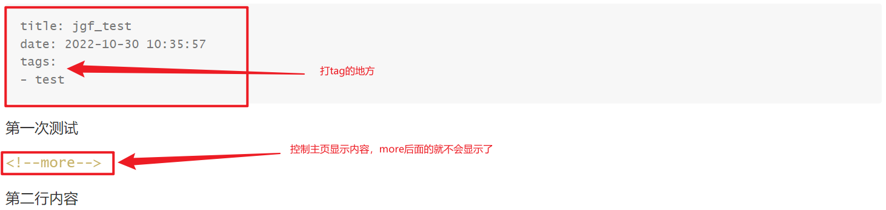

# Hexo多人协作

1.将仓库的hexo分支clone到本地

```
git clone -b hexo https://github.com/GraduateSupportTeam/GraduateSupportTeam.github.io.git
cd GraduateSupportTeam.github.io.git	# 进入本地文件
git branch -a	# 查看当前分支
```



2.安装hexo

​	先安装node.js

```
npm install hexo-cli -g
npm install
npm install hexo-delopyer-git
npm install hexo-asset-image --save	# 图片插件，这个没验证，可能也不需要
```

3.本地搭建

​	①新建一个markdown文件，使用这个命令

```
hexo new mdfile_name
```



​	②本地搭建

```
hexo cl	# 一般不需要，如果报错就需要
hexo g	# 生成配置文件
hexo s	# 本地查看静态页面
```

4.部署到远程仓库

​	①注意：每次第一次打开的时候一定要从远程仓库拉一下更新你本地的仓库内容，防止冲突。

```
git pull origin hexo	# 没有测试，可能对可能错，自行百度
```

​	②首先将本地的hexo下修改的内容都提交到远端hexo分支

```
git add .
git commit -m "修改内容记录"
git push origin hexo	# push上去，不带origin可能会报错
```

​	③部署到main分支下，用于静态页面显示

```
hexo d
```

